## **Module 3.1 - Observability**

Lab Scenario: Implementing Security, Observability, and GitOps for Arc-enabled Kubernetes Clusters

In this lab, you'll explore how to secure Arc-enabled Kubernetes clusters, observe the health and status of Arc-enabled Kubernetes clusters using Grafana and Azure Monitor, and deploy applications to the clusters using GitOps.

## **Module 3.1 - Secure the infrastructure**

Ensuring that the cluster and the workload running on it are critical for industrial applications. To do this we will use [Microsoft Defender for Containers](https://learn.microsoft.com/en-us/azure/defender-for-cloud/defender-for-containers-introduction).  Defender for Containers works by having a Defender sensor running as a [DaemonSet](https://kubernetes.io/docs/concepts/workloads/controllers/daemonset/) on each node in the cluster.  In addition, it also deploys Azure Policy for Kubernetes to centralize the enforcement of Kubernetes-specific policies.

#### **Onboard Cluster to Defender for Containers**

>[!tip] Because you're working in a new subscription for the lab, you may need to refresh the Defender for Cloud section to have Portal reflect the screenshots below.

To onboard your cluster, you'll do the following:

1. In the Azure Portal, navigate to Defender for Cloud
2. Under Management, navigate to **Environment settings**

    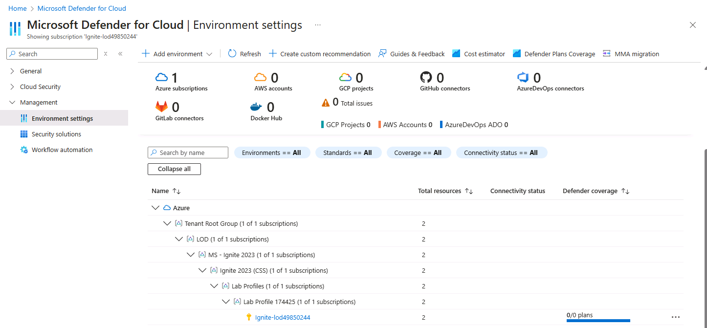
3. Select your subscription
4. Under Cloud Workload Protection (CWP), navigate to **Containers > Settings**

    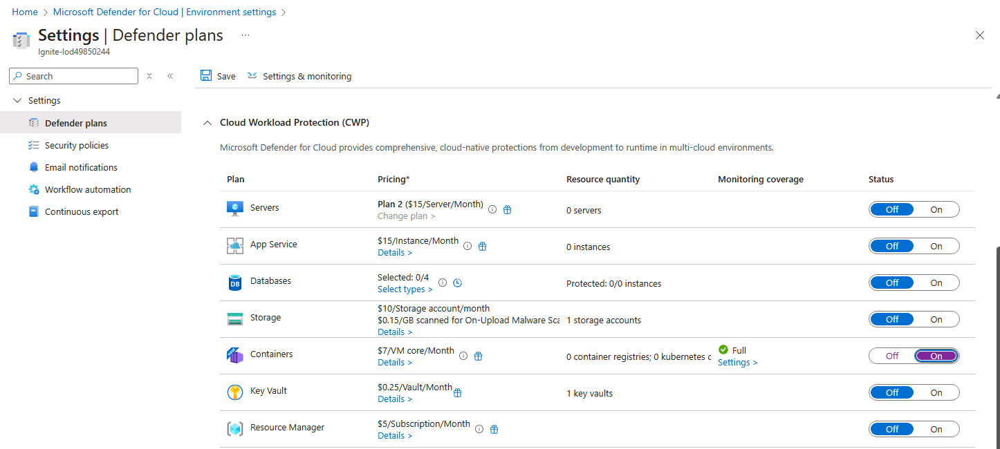
4. Turn on **Containers**
5. Click **Save**

#### **Wait for Defender Sensor to be deployed**

It may take several minutes for the Defender for Container resources to be deployed on your Kubernetes cluster.  Run `kubectl get pods -n mdc -w` to watch the status of this being deployed.

>[!tip] Wait for the pods in the **mdc** namespace to be running before proceeding to simulate the Defender alert.

#### Simulate Defender Alert

With the cluster onboarded to Defender for Cloud, you'll now simulate an event to generate a Defender alert.  From the terminal, run the following steps.

```shell
kubectl create namespace defendertest
kubectl config set-context --current --namespace defendertest
kubectl run test-shell --rm -i --tty --image ubuntu -- bash
```

Next, run the following in the container itself:
```shell
cp /bin/echo ./asc_alerttest_662jfi039n
./asc_alerttest_662jfi039n testing eicar pipe
exit

```

Now, go to Defender for Cloud, and clock on the **Security Alerts** blade within the Portal. In a few minutes, you should see an alert that says, "Microsoft Defender for Cloud test alert (not a threat). (Preview)".  

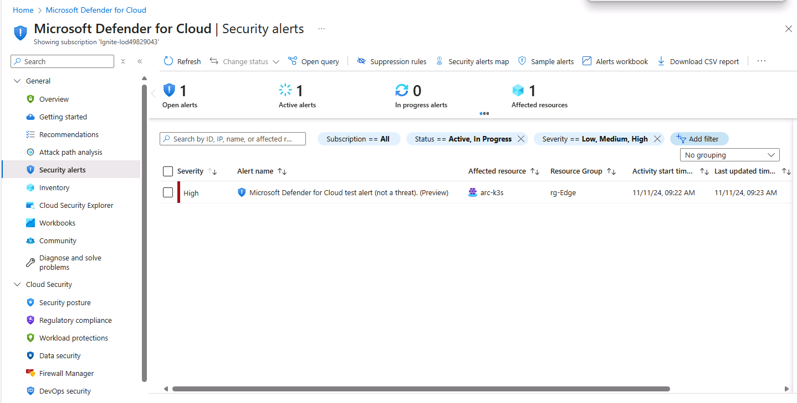

You'll next run additional code that simulates suspicious activity for the following types of activity:
* web shell - while there may be legitimate uses of this for troubleshooting, this is suspicious behavior on a cluster
* crypo mining - this type of activity is indicative of the cluster being used for nefarious purposes
* network scanning tools - this indicates that a malicious actor is scanning the network from within the Kubernetes cluster
* binary drift detection - this indicates that when an executable is being run that didn't come from the original container image

From within the k3s cluster, run the following:

```shell
curl -O https://raw.githubusercontent.com/microsoft/Defender-for-Cloud-Attack-Simulation/refs/heads/main/simulation.py
```

Now, execute:

```shell
python3 simulation.py
```

At the prompt, view the types of scenarios that can be run.  Enter **6** and press enter.  The simulation will take several minutes to run.


After several minutes, look at the security alerts in Defender for Cloud to see additional alerts.  While these are simulated attacks running in a lab, in the real-world you'd use these alerts to trigger actions to investigate and remediate the alerts.

### **Step 2 - Mark this module as complete**

Update the *userName* variable with the same name you used to register for the Leaderboard and run the following command in shell to define your Leaderboard username.

`userName="REPLACE_ME_PRETTY_PLEASE"; userId="${userName// /}"`

Run the following command to mark this module as completed.

`curl -X POST "https://jsleaderboard001-cnece0effvapgbft.westus2-01.azurewebsites.net/complete_task" -H "Content-Type: application/json" -d "{\"user_id\": \"$userId\", \"task_id\": 9}"`

## **Module 3.2 - Observability**

### What do we mean by observability?

Observability in Kubernetes is crucial for maintaining the performance, reliability, and availability of applications. In industrial scenarios, this is crucial because the workloads being deployed are critical for worker safety, manufacturing, and a host of other reasons.  Knowing that a system is healthy or, conversely, knowing that a system is experiencing problems is key to operate Kubernetes cluster effectively and efficiently.

In addition, we can use observability tools to make data-driven decisions.  For example, how effective is a particular piece of equipment?  How much of a certain product are we producing?

Step 1: Setting Up Grafana and Prometheus for On-Premises Monitoring

Prometheus is an open-source tool that collects and stores metrics from a variety of sources in real-time.  Grafana is an open-source data analytics and visualization tool.  In this lab, you will deploy Prometheus and Grafana within your on-premises Arc-enabled Kubernetes cluster. Grafana will be configured to collect and display metrics from Prometheus, a popular monitoring tool for Kubernetes.

>[!knowledge] While there is an Azure-native solution, known as [Azure Managed Grafana](https://learn.microsoft.com/en-us/azure/managed-grafana/overview), this lab focuses on self-hosting this solution.

### **Step 1. SSH into the Ubuntu k3s machine**

First, SSH to the k3s machine Step 1 - Remote into the Ubuntu server using ssh.

    ssh 192.168.1.100

>[!help]The password is: @lab.VirtualMachine(UbuntuServer22.04).Password
>[!alert]The IP address of the Ubuntu server may be 192.168.1.101

### **Step 2. Install Prometheus and Grafana using Helm**

A common way to install these tools is with Helm and the open-source [kube-prometheus-stack](https://github.com/prometheus-community/helm-charts/blob/main/charts/kube-prometheus-stack/README.md).

```shell
helm repo add prometheus-community https://prometheus-community.github.io/helm-charts
helm repo update
```

There are *lots* of different ways to configure this.  Inside VSCode, open artifacts/kube-prometheus-stack-values.yaml.

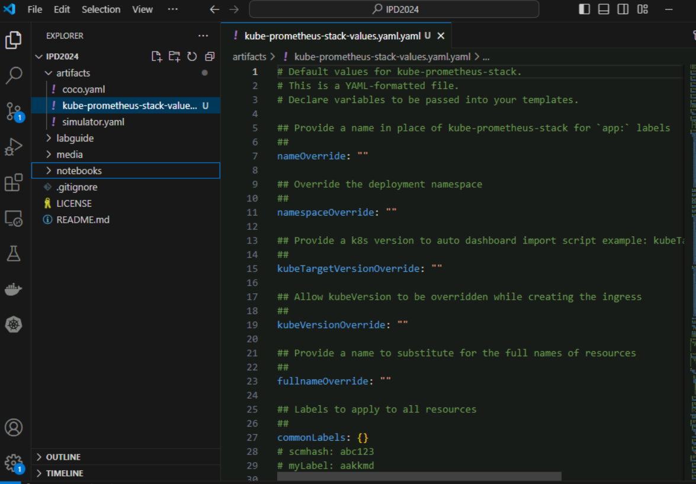

Inside the values file, there are many different parameters that we could set.  For example, line 1019 lists a value of **adminPassword: prom-operator**.  If you wanted to change this or any of the other default parameters, we could modify the values file.

>[!tip]Refer to [this section](https://github.com/prometheus-community/helm-charts/blob/main/charts/kube-prometheus-stack/README.md#configuration) of the Helm repository to learn more about customizing this particular chart.

For this lab, you'll leave the default settings in the value file.

To actually deploy, type:

```shell
helm install observability  --namespace observability --create-namespace prometheus-community/kube-prometheus-stack
```


Verify that the pods are running with the following command:

```shell
kubectl --namespace observability get pods -l "release=observability"
```

The above command will show the pods that were created as part of the Helm chart you installed an their status.  After a short period of time, all pods should be ready.

## **Step 3. Familiarize yourself with Grafana**

With the components necessary for Prometheus and Grafana running in your cluster, you'll need to temporarily expose the Grafana service outside the cluster.  In production, there are more robust ways to do this, like using an ingress controller; however, for the sake of simplicity, you'll run a port forwarding command to temporarily expose Grafana.

```shell
kubectl port-forward -n observability svc/observability-grafana --address 0.0.0.0 41367:80
```


This command exposes a specific service, **observability-grafana** so that it can be accessed outside the cluster on port 41367, which will be forwarded to port 80.  For more information on port forwarding, refer to the [Kubernetes documentation](https://kubernetes.io/docs/tasks/access-application-cluster/port-forward-access-application-cluster/) on the topic.

In your browser, go to 192.168.1.100:41367


[!help]The username is **admin** and the password is **prom-operator**

Login with the above credentials.  When you looked at the Helm values, you saw this default password.  While passwords should not typically be stored in Helm values files, this allows you to quickly get the observability stack running.

From the hamburger menu in the upper left, navigate to dashboards.

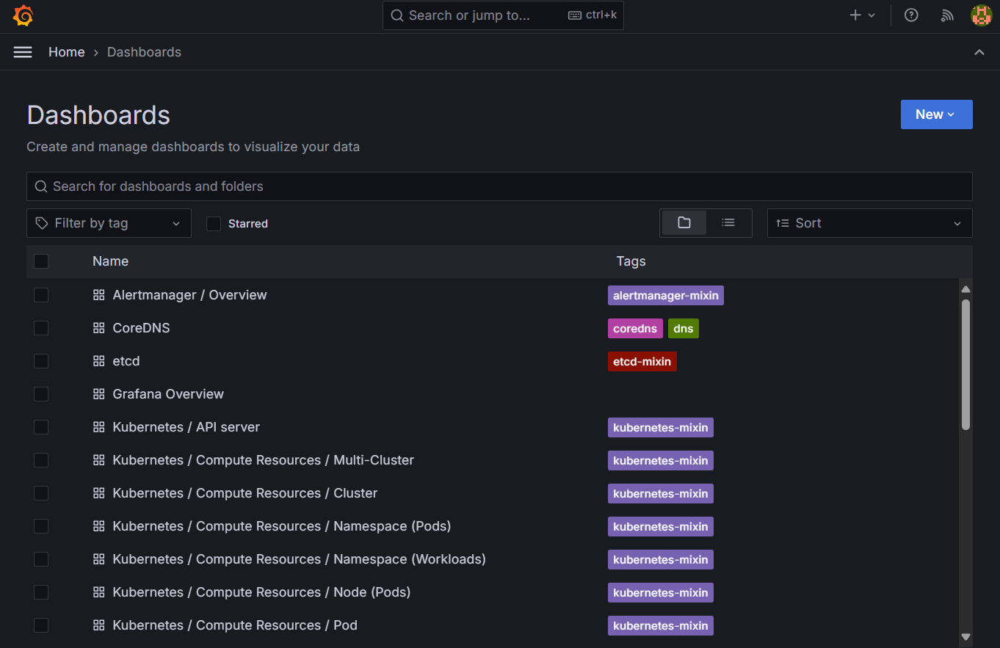

There are many pre-created dashboards already available.  Click on the dashboard entitled **Kubernetes / Compute Resources / Cluster**

This dashboard gives insight into the overall health of your Kubernetes cluster.  It's using prometheus and the underlying metrics it gets from [kube-state-metrics](https://github.com/kubernetes/kube-state-metrics) and [node exporter](https://github.com/prometheus/node_exporter).

>[!tip] spend a few minutes exploring this and other dashboards to see the types of information it presents

You can also explore the data through the use of [PromQL queries](https://prometheus.io/docs/prometheus/latest/querying/basics/).  For example, go to Home / Explore.  Change the query to use **code** and enter the following PromQL query (hit Shift+Enter to execute the query):

```
100 - (avg(rate(node_cpu_seconds_total{mode!="idle"}[5m])) by (instance) * 100 / avg(rate(node_cpu_seconds_total[5m])) by (instance))

```
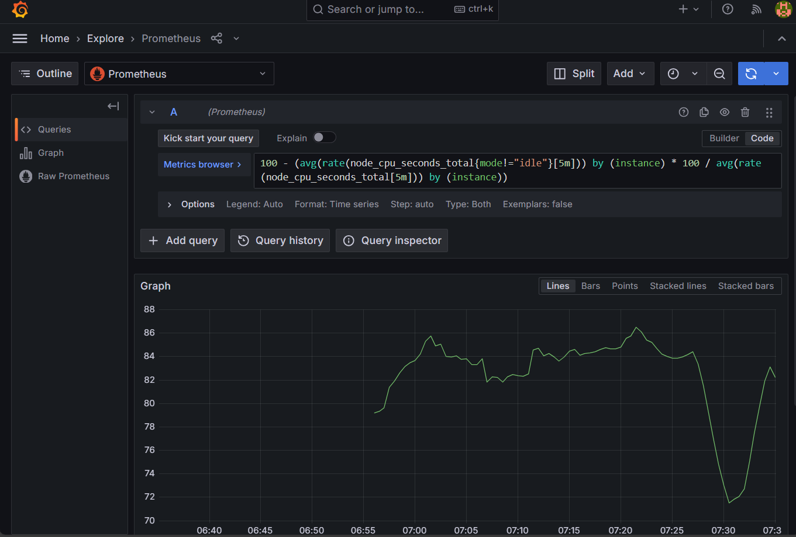

This query calculates the percentage of CPU time spent in non-idle states and subtracts it from 100 to get the idle CPU percentage.  While outside the scope of this lab, writing your own queries will be useful if you instrument your own applications and want to use custom dashboards to view metrics.

### **Step 4 - Mark this module as complete**

Update the *userName* variable with the same name you used to register for the Leaderboard and run the following command in shell to define your Leaderboard username.

`userName="REPLACE_ME_PRETTY_PLEASE"; userId="${userName// /}"`

Run the following command to mark this module as completed.

`curl -X POST "https://jsleaderboard001-cnece0effvapgbft.westus2-01.azurewebsites.net/complete_task" -H "Content-Type: application/json" -d "{\"user_id\": \"$userId\", \"task_id\": 8}"`

## **Using Azure Monitor for Cloud-Based Insights**

Azure Monitor provides a comprehensive solution for collecting, analyzing, and acting on telemetry data from resources running directly in Azure as well as on-premises resources. For Arc-enabled Kubernetes clusters, Azure Monitor helps extend observability into the cloud, ensuring you have a centralized view of your cluster's health.

### **Step 1 - Enable Container Insights**

To enable Container Insights for this Arc-enabled Kubernetes cluster, navigate to the Azure Portal and find the cluster you onboarded earlier.  Under the Monitoring blade, find **Insights**.


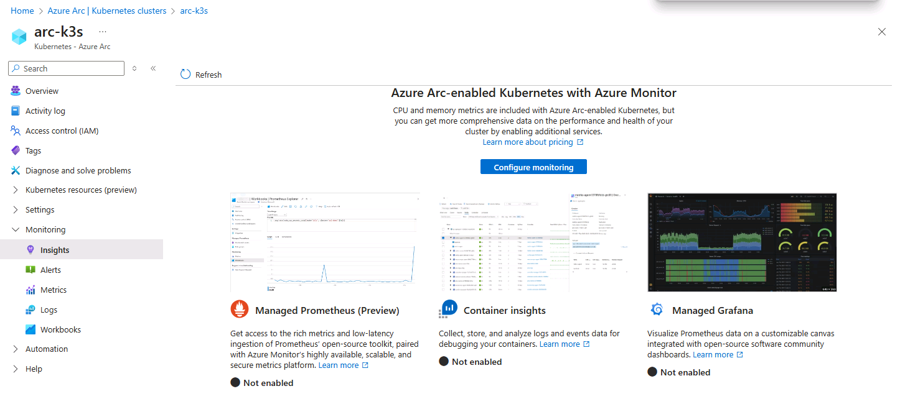


Click on **Configure monitoring**

De-select **Enable Prometheus metrics** and **Enable Grafana** if checked.  Expand the Advanced Settings at the bottom of the dialogue to see the options you're presented with.  The data generated from Container Insights will be populated to the Log Analytics Workspace selected here.  In addition, note the various presets for Cost Presents.  Kubernetes generates significant amounts of data, so depending on your needs, you can alter the frequency of collection and filter the collection to only specific namespaces.

Leave the default settings and click **Configure**

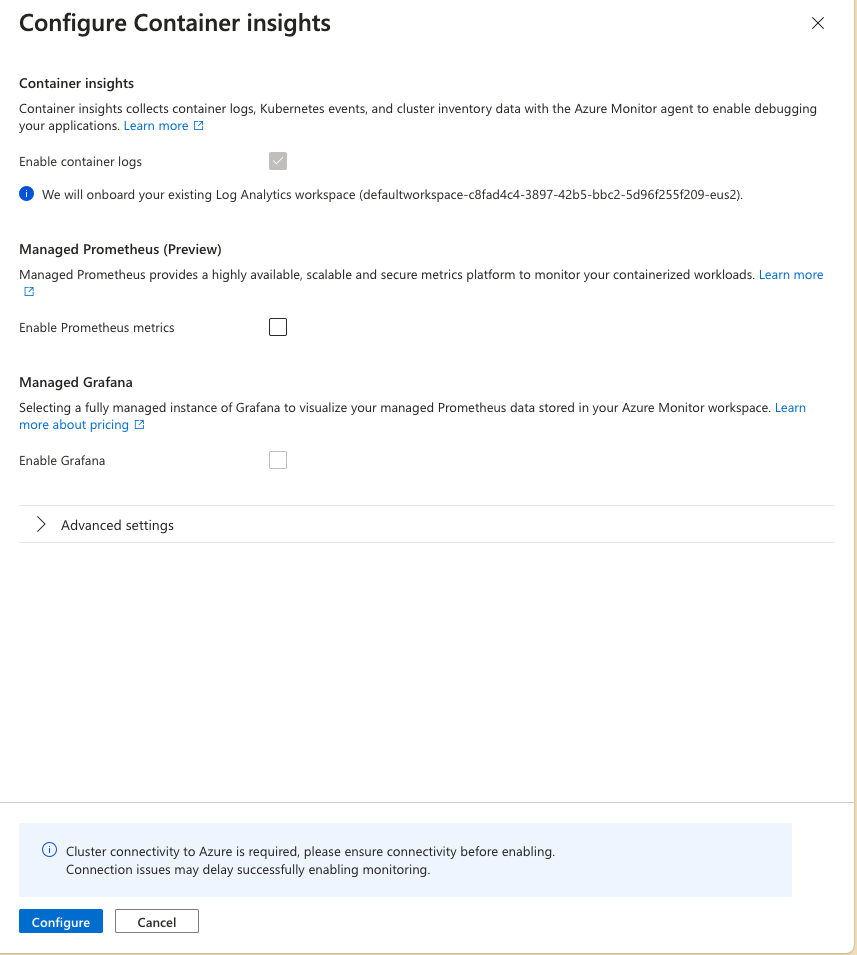

With Container Insights, you can use Azure as the focal point for your cluster monitoring.

### **Step 2 - View Cluster Data in Azure Monitor**

>[!alert] It may take several minutes for the data from Container Insights to be visible within the Azure Portal

After Container Insights is configured on the cluster, go to the Azure Portal


### **Step 3 - Mark this module as complete**

Update the *userName* variable with the same name you used to register for the Leaderboard and run the following command in shell to define your Leaderboard username.

`userName="REPLACE_ME_PRETTY_PLEASE"; userId="${userName// /}"`

Run the following command to mark this module as completed.

`curl -X POST "https://jsleaderboard001-cnece0effvapgbft.westus2-01.azurewebsites.net/complete_task" -H "Content-Type: application/json" -d "{\"user_id\": \"$userId\", \"task_id\": 9}"`


## **Module 3.3 - GitOps**

Ultimately the reason why you configured Arc-enabled Kubernetes clusters and monitor them is to deploy applications on the cluster.  While there are many ways to do this, GitOps provides a framework to ensure that what's deployed to a Kubernetes cluster is based on the code checked in to a Git repository.  Changes to the codebase are committed to the repository and updates are automatically applied.  One of the primary benefits of this approach is that managing the applications deployed to multiple clusters across the globe can centrally managed.  For example, imagine a manufacturer that has on-prem workloads in North America, South America, Europe, and Asia.  Manually pushing changes to each cluster may result in slight differences in what gets deployed.  Using GitOps, the workloads across these facilities can automatically be updated and they will reconcile themselves with the Git repository.  The diagram below illustrates the typical flow of developers, application operators, and cluster operators.


### **Step 1. Browse the Manifests**

Inside VSCode, explore the contents within the **artifacts/gitops-lab/rtsp** and **artifacts/gitops-lab/shopper-insights** directories.  These contain Kubernetes manifestss used for deploying a the sample application.  While you could manually apply these manifests using `kubectl`, deploying through GitOps ensures that the cluster uses the underlying Git repository as the source of truth.

### **Step 2. Enable GitOps on Cluster**

In the Azure Portal, navigate to your Arc-enabled Kubernetes cluster.  Under Settings, go to the GitOps blade.

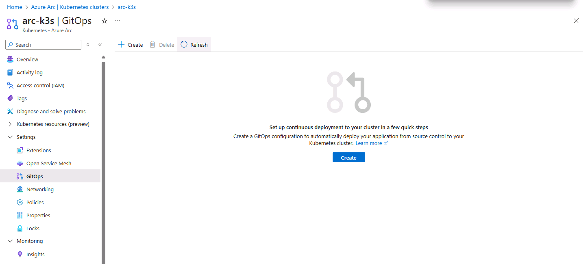

Click on **Create**

In the _Create a GitOps configuration_ screen, populate the following to match the below screenshot.

    * Configuration name: gitops-lab

    * Namespace: gitops-lab

    * Scope: Cluster 


Click **Next**

On the _Source_ screen, enter the following to match the sceenshot below:

    * Source kind: Git Repository

    * Repository URL: https://github.com/dkirby-ms/IPD2024

    * Reference type: branch

    * Branch: main

    * Repository Type: Public

    * Sync interval (minutes): 10

    * Sync timeout (minutes): 10
    


Click **Next**


On the _Kustomizations_ screen, click on **Create**

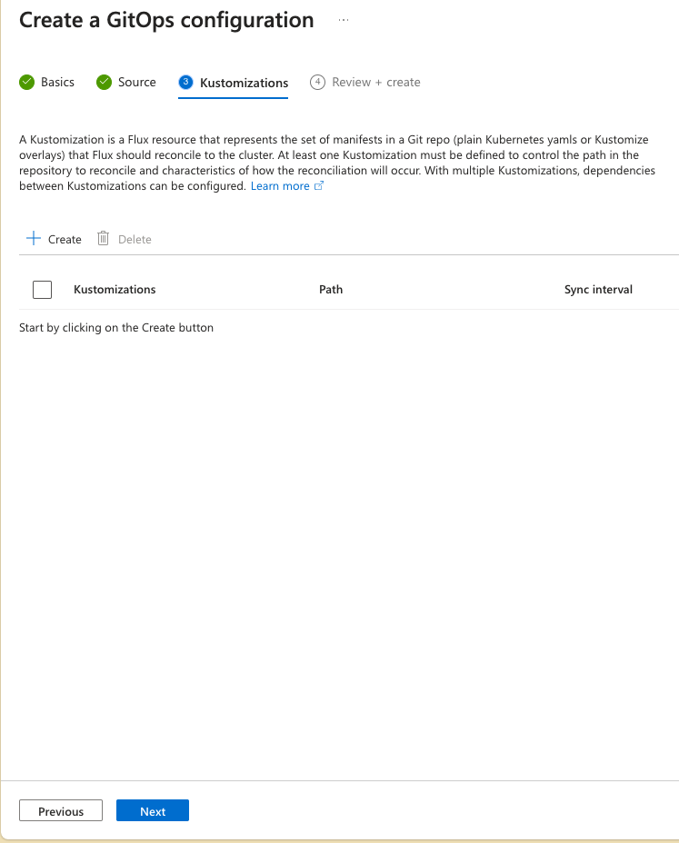

Populate the first Kustomization with the following to match the screenshot below:

    * Instance name: rtsp

    * Path: ./artifacts/gitops-lab/rtsp/

    * Sync interval (minutes): 10

    * Sync timeout (minutes): 10

    * Retry interval (minutes): blank

    * Prune: checked

    * Force: checked

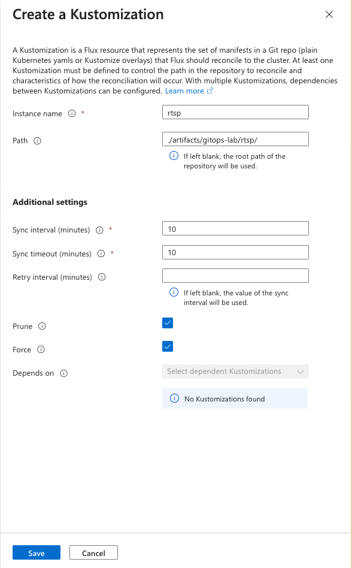

Click on **Create** again to create a second Kustomization.

>[!alert] this Kustomization depends on the kube-prometheus-stack being deployed, which you did in Module 3.2

Populate the second Kustomization with the following to match the screenshot below:

    * Instance name: shopper-insights

    * Path: ./artifacts/gitops-lab/shopper-insights/

    * Sync interval (minutes): 10

    * Sync timeout (minutes): 10

    * Retry interval (minutes): blank

    * Prune: checked

    * Force: checked

    * Depends on: rtsp


The Kustomizations screen should look similar to the screenshot below.


With both Kustomizations in place, click **Next**.  On the _Review + create_ screen, click **Create**.

It will take several minutes for the Flux extension to be installed and the GitOps configuration to be applied.  During this time, run `kubectl get pods -A -w` to watch the flux-system pods be deployed and continue watching for pods to appear in the gitops-lab namespace.

### **Step 3. Verify GitOps Compliance**

>[!alert] It will take several minutes for the GitOps configuration to be fully applied


Refresh the GitOps blade in the Portal and check the status of the deployment.  During this time, you may see a _Compliance state_ of **Non-Compliant** while the manifests are fully deployed.  After a successful deployment, the GitOps configuration will show that it's compliant.  While outside the scope of this lab, consider how using [GitOps configurations along with Azure Policy](https://learn.microsoft.com/azure/azure-arc/kubernetes/use-azure-policy-flux-2) could be used to enforce compliance across multiple clusters.
    
## **Congratulations, you have reached the end of this lab.**

- Call to action
- Other sessions
- Jumpstart links
